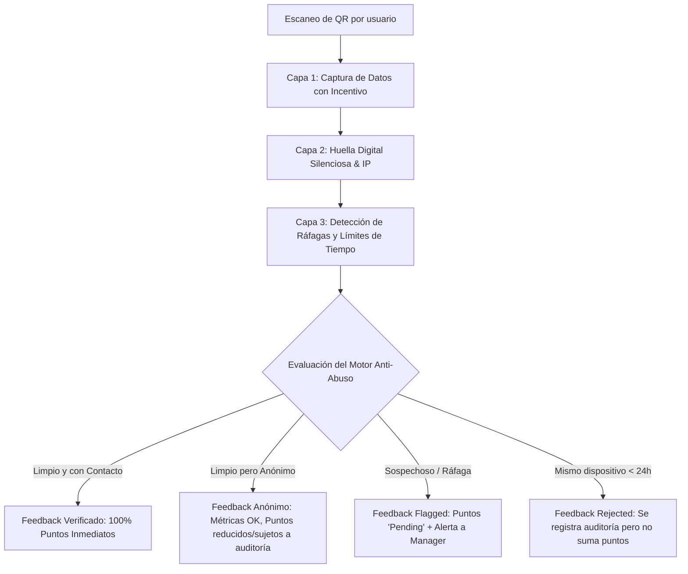

# Propuesta de Mecanismos Contra el Abuso y Auto-Reconocimiento

## 1. Introducción y Contexto

En una plataforma de reconocimiento y recompensas basada en feedback de comensales vía códigos QR (como cafeterías, bares y restaurantes), existe un incentivo natural para el **gaming** o **fraude interno**:

> **El problema del auto-reconocimiento:**  
> Un empleado (mozo, camarero o barista) puede escanear repetidamente el código QR con su propio teléfono móvil o pedirle a amigos/colegas que lo hagan, auto-adjudicándose 5 estrellas, reconocimientos y acumulando puntos para canjear por premios monetarios o beneficios laborales.

Si este comportamiento no se controla:
1. El negocio cliente (Dueño / Manager) pierde dinero en recompensas ilegítimas.
2. El sistema pierde credibilidad entre los compañeros honestos.
3. Las métricas de desempeño dejan de reflejar la realidad del servicio.

### El dilema central: Seguridad vs. Fricción
- El comensal real está comiendo o a punto de pagar. Si se le impone crear un usuario, ingresar contraseñas o resolver *captchas* molestos, **la tasa de respuesta cae más del 70%**, violando la regla del PRD de completar el feedback en menos de 30 segundos.
- Por ende, el sistema debe aplicar una estrategia de **Defensa en Profundidad (Multicapa)** que combine **captura voluntaria de valor (Lead Gen para el local)** con **filtros invisibles silenciosos en el backend**.

---

## 2. Estrategia Dual: Anti-Abuso + Generación de Leads (CRM)

La necesidad de identificar al autor del feedback se transforma en una **ventaja comercial clave para vender la plataforma**:

> **Convertir el formulario de feedback en un motor de captación de clientes para el restaurante.**

### Flujo en el Front-End (UX):
1. **Pasos 1 a 4 (Fluido y sin fricción):**  
   El cliente escanea el QR, califica (1 a 5 estrellas), elige al empleado y tilda las dimensiones destacadas (*Amabilidad*, *Rapidez*).
2. **Paso 5 (Gancho con propuesta de valor):**  
   Antes de finalizar, la pantalla muestra una invitación atractiva:
   > *"¡Muchas gracias! ¿Te gustaría participar de nuestro sorteo mensual o recibir una atención en tu próxima visita? Dejanos tu email o WhatsApp."*
   > `[ Input: Email / Celular ]`  
   > `[ Checkbox: Deseo recibir novedades y promociones exclusivas ]`  
   > `[ Botón: Enviar feedback y participar ]`  
   > `[ Enlace secundario: Omitir y enviar anónimo ]`

### Beneficios de este enfoque:
- **Para el Comensal:** Siente que recibe algo a cambio de su dato de contacto (sorteo, descuento, café de cortesía).
- **Para el Dueño del Restaurante (Owner):** Construye una base de datos propia de comensales frecuentes para campañas de marketing (CRM de fidelización).
- **Para la Seguridad Anti-Fraude:** El dato personal permite validar la identidad del cliente y desactiva el auto-reconocimiento casual de empleados.

---

## 3. Las 5 Capas de Defensa en Profundidad



---

### Capa 1: Validación y Filtrado de Leads (Front & API)
Cuando un usuario ingresa un email o teléfono:
1. **Validación sintáctica estricta:** Comprobación de formato estándar RFC 5322.
2. **Bloqueo de dominios de correos descartables (Disposable Emails):**  
   Filtro en backend contra listas públicas conocidas de correos temporales (`temp-mail.org`, `10minutemail`, `guerrillamail`, `yopmail`, etc.). Si un empleado intenta crear correos ficticios de 1 solo uso, la API los rechaza o degrada a anónimo.
3. **Entidad `Customer`:**  
   Si el email es legítimo, se busca o crea el registro en la tabla `CUSTOMER` asociado a la `Organization`, almacenando la marca de tiempo y consentimiento (`marketing_opt_in: true`).

---

### Capa 2: Huella Digital Silenciosa (Silent Device Fingerprint)
El comensal no debe realizar ninguna acción. El cliente web (SPA mobile) genera un identificador único local:

1. **Client Fingerprint (`client_fingerprint`):**
   - Se genera combinando un UUID persistido en `localStorage` / `IndexedDB` junto con señales del navegador (resolución de pantalla, User-Agent, lenguaje, WebGL hash).
2. **Hash de IP con Salt Rotativo (`ip_hash`):**
   - Para cumplir con regulaciones de privacidad (evitando almacenar IPs directas en texto plano), se almacena `SHA256(client_ip + secret_salt)`.
3. **Regla de oro de unicidad por dispositivo:**
   > **Un mismo dispositivo (`client_fingerprint`) NO puede calificar al mismo empleado más de 1 vez cada 24 horas (o 48 horas según configuración).**
   - Si un empleado abre el QR en su propio teléfono móvil y se califica a sí mismo, la segunda vez que lo intente en el mismo día, el sistema detectará la coincidencia de huella y rechazará la asignación de puntos.

---

### Capa 3: Detección de Ráfagas y Límites Operativos (Burst Heuristics)
Incluso si un empleado utiliza navegación de incógnito o intenta limpiar cookies, los patrones temporales delatan el fraude:

1. **Límite de velocidad por empleado (Velocity Thresholds):**
   - En gastronomía, la rotación de mesas tiene tiempos físicos reales. Es estadísticamente imposible que un mismo mozo atienda y reciba 5 feedbacks de 5 estrellas en un intervalo de 10 minutos.
   - **Regla:** Si un empleado recibe más de $N$ feedbacks (ej. > 3) en una ventana de 15 minutos, los feedbacks posteriores entran automáticamente en estado `flagged`.
2. **Anomalía de Subred Wi-Fi del Local:**
   - La mayoría de los empleados están conectados a la red Wi-Fi del restaurante.
   - Si entran 10 calificaciones en el día con la misma IP externa del restaurante hacia el mismo colaborador y sin datos de contacto de clientes, se enciende una bandera amarilla de sospecha.

---

### Capa 4: Matriz de Confianza (Verificado vs. Anónimo vs. Flagged)

| Nivel | Condiciones | Impacto en Métricas de Local | Impacto en Puntos del Empleado | Estado del Ledger |
| :--- | :--- | :--- | :--- | :--- |
| **Verificado (`verified`)** | Email/teléfono real no temporal + huella limpia + sin ráfagas. | Suma 100% | Otorga **100% de los puntos** configurados por regla. | `confirmed` |
| **Anónimo (`anonymous`)** | Sin datos de contacto, pero huella limpia y dentro de tiempos normales. | Suma 100% al NPS / Satisfacción general. | Otorga **puntos atenuados** (ej. 30% o 50% de los puntos) o entra a aprobación. | `confirmed` / `pending` |
| **Sospechoso (`flagged`)** | Ráfaga inusual, IP repetida sospechosa o comportamiento anómalo. | Se aisla para no distorsionar estadísticas. | **0 puntos automáticos.** Queda en espera de revisión del Manager. | `pending` |
| **Rechazado (`rejected`)** | Dispositivo duplicado en < 24hs hacia el mismo empleado. | Descartado. | **0 puntos.** Queda registrado sólo en logs de seguridad. | `cancelled` |

---

### Capa 5: Ventana de Consolidación (Cool-Down) y Moderación del Manager
- **No canje instantáneo:** Los puntos acumulados por un empleado pasan a estado `pending` y se consolidan al final de la jornada laboral o turno.
- **Panel de Alertas en el Dashboard del Manager:**  
  El manager dispone de una sección donde visualiza las advertencias:
  > ⚠️ *Alerta: "El colaborador Juan Pérez recibió 4 calificaciones en 12 minutos desde la misma conexión. Los puntos están en pausa."*
- El Manager tiene un botón para:
  - **Aprobar:** Si verifica que fue un evento real (ej. una mesa larga de cumpleaños de 15 personas).
  - **Rechazar / Vetar:** Si comprueba que fue un intento de engaño.

---

## 4. Contexto Opcional: QR por Mesa o Número de Comanda

Para establecimientos con servicio a la mesa, el sistema soporta dos anclas físicas adicionales:

1. **Token de Mesa en el QR:**
   - Cada código QR impreso incluye un identificador de mesa: `https://app.ceibo.studio/f/tok_abc123?table=14`.
   - Si un empleado se auto-asigna reconocimientos indicando que atendió la "Mesa 14" cuando esa mesa estuvo vacía o asignada a otro compañero, el fraude queda expuesto inmediatamente.
2. **Número de Ticket / Comanda (Opcional):**
   - Posibilidad de solicitar los últimos 4 dígitos del ticket de consumición. Esto asegura que solo quien efectivamente pagó una cuenta pueda emitir una valoración.

---

## 5. Implementación en Código y Esquema

### 5.1 Campos requeridos en `Feedback` y `PointLedgerEntry`

```prisma
model Feedback {
  id                 String    @id @default(cuid())
  organizationId     String
  locationId         String
  employeeId         String?
  customerId         String?   // Vinculación opcional con cliente captado
  rating             Int
  comment            String?
  
  // Seguridad y Anti-Abuso
  clientFingerprint  String    // Hash anónimo del dispositivo
  ipHash             String    // SHA-256 de la IP con salt
  verificationLevel  String    @default("anonymous") // verified | anonymous
  status             String    @default("approved")  // approved | flagged | rejected
  flagReason         String?   // ej: "VELOCITY_BURST", "DUPLICATE_DEVICE_24H"
  
  createdAt          DateTime  @default(now())

  @@index([clientFingerprint, employeeId, createdAt])
  @@index([employeeId, createdAt])
  @@index([status])
}

model Customer {
  id             String    @id @default(cuid())
  organizationId String
  email          String?
  phone          String?
  name           String?
  marketingOptIn Boolean   @default(false)
  createdAt      DateTime  @default(now())
  updatedAt      DateTime  @updatedAt

  @@unique([organizationId, email])
}

model PointLedgerEntry {
  id             String    @id @default(cuid())
  employeeId     String
  amount         Int
  reason         String
  status         String    @default("confirmed") // pending | confirmed | cancelled
  createdAt      DateTime  @default(now())

  @@index([employeeId, status])
}
```

### 5.2 Lógica en el Servicio de Feedback (Pseudocódigo)

```javascript
async function processIncomingFeedback(data) {
  const { organizationId, locationId, employeeId, rating, clientFingerprint, ipHash, customerData } = data;

  let verificationLevel = "anonymous";
  let customerId = null;

  // 1. Validar si el cliente proporcionó datos de contacto reales
  if (customerData?.email && isValidEmail(customerData.email) && !isDisposableEmail(customerData.email)) {
    verificationLevel = "verified";
    const customer = await findOrCreateCustomer(organizationId, customerData);
    customerId = customer.id;
  }

  // 2. Control de repetición por dispositivo en últimas 24hs
  if (employeeId) {
    const recentFromDevice = await prisma.feedback.findFirst({
      where: {
        clientFingerprint,
        employeeId,
        createdAt: { gte: new Date(Date.now() - 24 * 60 * 60 * 1000) }
      }
    });

    if (recentFromDevice) {
      // Bloquear: Intento de auto-calificación reiterada desde el mismo teléfono
      return await prisma.feedback.create({
        data: {
          ...data,
          customerId,
          verificationLevel,
          status: "rejected",
          flagReason: "DUPLICATE_DEVICE_24H"
        }
      });
    }

    // 3. Control de ráfagas (Velocity Burst) en los últimos 15 minutos
    const recentEmployeeFeedbacks = await prisma.feedback.count({
      where: {
        employeeId,
        createdAt: { gte: new Date(Date.now() - 15 * 60 * 1000) }
      }
    });

    if (recentEmployeeFeedbacks >= 3) {
      // Marcar como sospechoso para revisión del manager
      return await recordFlaggedFeedback(data, customerId, verificationLevel, "VELOCITY_BURST");
    }
  }

  // 4. Feedback legítimo aprobado
  return await recordApprovedFeedback(data, customerId, verificationLevel);
}
```

---

## 6. Privacidad y Cumplimiento Normativo

Para operar con total transparencia y ajustarse a normativas de protección de datos personales (como GDPR, LPDP en Latinoamérica y Ley 25.326):
1. **Anonimización de IPs:** Nunca se almacena la dirección IP en texto plano; se utiliza un hash criptográfico con clave secreta (`salt`).
2. **Consentimiento Expreso:** El checkbox de recepción de comunicaciones comerciales no está pre-tildado y aclara que el comensal puede darse de baja en cualquier momento.
3. **No intrusión:** El fingerprinting se utiliza estrictamente con fines de **integridad técnica y prevención de fraude**, sin rastrear la navegación del usuario fuera de la web app de Ceibo.

---

## 7. Conclusión y Recomendación para el Roadmap

Implementar esta estrategia le otorga a Ceibo Studio una doble ventaja competitiva:
1. **Blindaje de valor:** Los clientes pagan con confianza sabiendo que el presupuesto de reconocimientos y puntos premia a los colaboradores verdaderamente valorados por la clientela real.
2. **Valor tangible inmediato:** El restaurante no sólo adquiere una herramienta de RRHH/Talento, sino también una herramienta de **captación de clientes para su negocio**.

Se recomienda incorporar la **Capa 1 (Captura de Lead)** y la **Capa 2 (Fingerprint con límite de 24h)** directamente en la **Fase 2 del roadmap de desarrollo**, dejando las heurísticas complejas de ráfagas para la Fase 5 junto con el panel de moderación del Manager.
