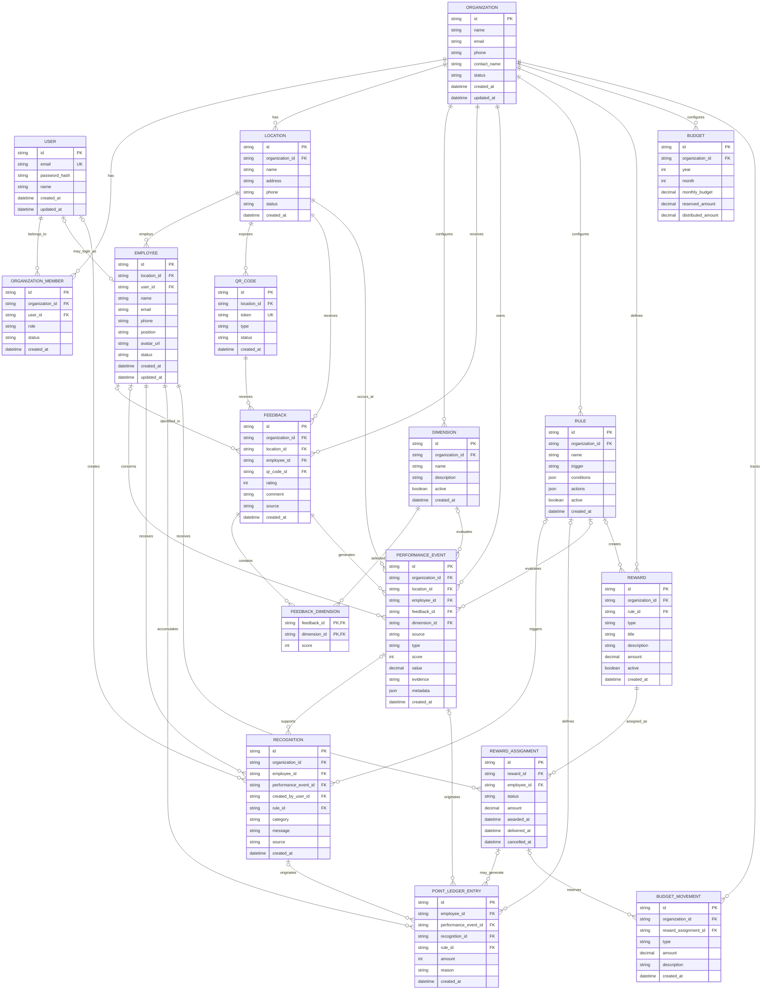

# Propuesta de modelo de datos — Ceibo Studio

## Contexto

Esta propuesta se basa en:

- El código existente del repositorio `Lautarocabrier/Ceibo.studio`.
- El esquema actual de Prisma en `BE/prisma/schema.prisma`.
- El contrato de API definido en `BE/API_CONTRACT.md`.
- El documento de producto `PRD — Plataforma de Activación del Talento V0.1.md`.

La rama actual implementa principalmente autenticación, Super Admin, clientes y usuarios administradores. El PRD requiere además sucursales, empleados, feedback, eventos de desempeño, reconocimientos, puntos, reglas, recompensas y códigos QR.

## 1. Modelo actual

Actualmente Prisma define únicamente dos entidades:

```text
User
- id
- email
- passwordHash
- name
- role: SUPERADMIN | CUSTOMER
- clientId nullable

Client
- id
- name
- email
- phone
- contactName
- status: active | inactive
```

Relación actual:

```text
Client 1 ──────── N User
```

El frontend ya anticipa conceptos que todavía no están persistidos en base de datos, como empleados, dashboard, evidencia, reconocimientos, QR, performance score y administradores por negocio.

## 2. Diagrama entidad-relación sugerido



## 3. Entidades y responsabilidades

### Organization

Es la evolución conceptual de `Client`. Representa al negocio, funciona como raíz del multi-tenancy y contiene sucursales, dimensiones, reglas, recompensas y usuarios.

Durante una migración gradual se puede conservar el nombre `Client` en la base y en las rutas actuales (`/api/clients`), pero el dominio futuro debería utilizar `Organization`.

### User

Representa una cuenta autenticable. Los roles sugeridos son:

```text
SUPERADMIN
OWNER
MANAGER
EMPLOYEE
```

El rol actual `CUSTOMER` parece representar al administrador del negocio, no al cliente final que deja feedback. El cliente final no necesita una cuenta en el MVP.

### OrganizationMember

Relaciona usuarios con organizaciones y permite definir roles y estados por organización. Es preferible a depender únicamente de `User.clientId`, porque permite futuras membresías múltiples y autorización más flexible.

### Location

Representa una sucursal. La relación recomendada es:

```text
Organization 1 ──── N Location
```

El campo `location` del frontend debería convertirse en una entidad, no mantenerse como texto dentro de `Client`.

### Employee

Representa a la persona cuyo desempeño será medido. Debe pertenecer a una `Location` y puede opcionalmente estar vinculada a un `User` si necesita iniciar sesión.

Los valores `performanceScore`, `satisfactionScore`, `feedbackCount`, `recognitionCount` y `points` deberían calcularse desde eventos, reconocimientos y movimientos, en lugar de ser la fuente principal almacenada en `Employee`.

### Feedback

Representa la respuesta original del cliente. No requiere autenticación, puede no identificar a un empleado y puede contener varias dimensiones.

Campos principales:

```text
id
organization_id
location_id
employee_id nullable
qr_code_id nullable
rating
comment nullable
source
created_at
```

### FeedbackDimension

Tabla intermedia para resolver la relación muchos-a-muchos entre `Feedback` y `Dimension`. Es preferible a guardar `dimensions[]` como un array porque permite filtrar, calcular métricas y aplicar reglas por dimensión.

### PerformanceEvent

Es la entidad central del producto. Cada feedback válido puede generar uno o más eventos, por ejemplo un evento de amabilidad y otro de resolución.

Campos mínimos definidos por el PRD:

```text
id
organization_id
location_id
employee_id
source
type
dimension_id
score
value
evidence
metadata
created_at
```

Las fuentes iniciales pueden ser `customer` y `manager`, dejando preparado el modelo para `peer`, `system`, `goal` y `learning`.

### Recognition

Representa un reconocimiento manual o automático. Debe conservar el usuario que lo creó o la regla que lo originó.

### PointLedgerEntry

Los puntos deben modelarse como un ledger, no como un simple campo `Employee.points`. Cada movimiento debe tener un origen y no debe modificarse silenciosamente.

Ejemplo:

```text
+10 Customer recognition
+10 Manager recognition
+5 Resolution highlight
```

El balance se obtiene sumando los movimientos del empleado.

### Rule

Representa las reglas automáticas. Para V0.1 se recomienda almacenar `conditions` y `actions` como JSON, sin construir un lenguaje de reglas propio.

Ejemplo:

```text
WHEN feedback_received
IF rating >= 5 AND employee != null
THEN add_points(10)
AND create_recognition("Customer Hero")
```

### Reward y RewardAssignment

`Reward` representa una recompensa configurada por la organización. `RewardAssignment` representa una asignación concreta a un empleado.

La separación permite entregar la misma recompensa varias veces a distintos empleados.

Estados sugeridos:

```text
pending
awarded
delivered
cancelled
```

### QRCode

Cada sucursal puede tener uno o más códigos QR. El QR debe contener solamente un token o identificador público; no debe almacenar información crítica.

Flujo de resolución:

```text
QRCode → Location → Organization
```

### Budget y BudgetMovement

El PRD solicita tracking de presupuesto, pero no procesamiento de dinero. `Budget` puede manejar el presupuesto mensual y `BudgetMovement` registrar reservas y distribución asociadas a recompensas.

## 4. Flujo de datos principal

```text
QR Code
   ↓
Location
   ↓
Feedback
   ├── rating
   ├── employee_id opcional
   ├── comment
   └── dimensions
          ↓
  FeedbackDimension
          ↓
PerformanceEvent
          ↓
Rule evaluation
   ├── Recognition
   ├── PointLedgerEntry
   └── RewardAssignment
          ↓
Employee Dashboard
Manager Dashboard
```

Ejemplo:

```text
Cliente escanea QR de una sucursal
        ↓
Envía rating 5
        ↓
Selecciona empleado
        ↓
Selecciona Amabilidad y Resolución
        ↓
Se crea Feedback
        ↓
Se crean FeedbackDimension
        ↓
Se crean PerformanceEvent
        ↓
Una regla detecta rating >= 5
        ↓
Se crea Recognition "Customer Hero"
        ↓
Se agregan puntos al ledger
        ↓
El manager y el empleado ven la evidencia
```

## 5. Recomendaciones de migración

### 5.1 Evolucionar `Client` a `Organization`

Mantener temporalmente `Client` puede evitar romper las rutas actuales, pero las nuevas APIs deberían orientarse al dominio del PRD:

```text
/api/organizations
/api/locations
/api/employees
/api/feedback
/api/events
/api/recognitions
/api/rules
/api/rewards
```

### 5.2 Reemplazar progresivamente `User.clientId`

El campo puede conservarse durante una primera migración, pero a futuro conviene crear `OrganizationMember` para separar pertenencia y autorización.

### 5.3 Implementar sucursales antes que empleados

La relación recomendada es:

```text
Employee → Location → Organization
```

Esto permite que un manager acceda únicamente a los empleados de su sucursal.

### 5.4 Evitar métricas derivadas como fuente de verdad

Las métricas deben derivarse de:

```text
Feedback
PerformanceEvent
Recognition
PointLedgerEntry
RewardAssignment
```

Podrán materializarse posteriormente mediante vistas o procesos de agregación si el volumen lo requiere.

### 5.5 Considerar PostgreSQL

El PRD recomienda PostgreSQL, mientras que el esquema actual utiliza SQLite:

```prisma
datasource db {
  provider = "sqlite"
}
```

SQLite puede servir para desarrollo inicial, pero PostgreSQL es más apropiado para multi-tenancy, dashboards y campos JSON (`metadata`, `conditions`, `actions`).

## 6. Orden sugerido de implementación

### Fase 1 — Base organizacional

```text
Organization o Client temporal
Location
OrganizationMember
Employee
```

Actualizar los roles a:

```text
SUPERADMIN
OWNER
MANAGER
EMPLOYEE
```

### Fase 2 — Feedback

```text
QRCode
Feedback
Dimension
FeedbackDimension
```

Endpoints iniciales sugeridos:

```text
GET /feedback/:locationId
POST /feedback
```

### Fase 3 — Performance

```text
PerformanceEvent
```

Crear automáticamente eventos a partir de cada feedback válido.

### Fase 4 — Reconocimientos y puntos

```text
Recognition
PointLedgerEntry
```

Implementar reconocimiento manual y automático.

### Fase 5 — Reglas y recompensas

```text
Rule
Reward
RewardAssignment
Budget
BudgetMovement
```

### Fase 6 — Dashboards

Construir los dashboards a partir de consultas sobre:

```text
Feedback
PerformanceEvent
Recognition
PointLedgerEntry
RewardAssignment
```

## 7. Conclusión

El esquema actual de `User` y `Client` es una base de administración de clientes, pero todavía no representa la plataforma de activación del talento definida en el PRD.

La entidad que debe guiar el diseño futuro es `PerformanceEvent`, conectando la cadena:

```text
Organization
 → Location
 → Employee
 → Feedback
 → PerformanceEvent
 → Recognition
 → Points
 → Reward
```
